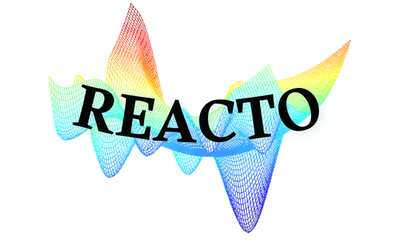

# MET - Molecular Experimental Toolkit



## Overview

**MET** is a comprehensive, AI-powered platform for experimental design, data analysis, and optimization in chemistry. Built for chemists, researchers, and data scientists, MET combines intuitive data management with cutting-edge Bayesian optimization to accelerate scientific discovery and reduce experimental costs.

### 🎯 Key Capabilities

- **Intelligent Data Management**: Upload, visualize, and edit experimental data with a easy to use spreadsheet interface
- **Interactive Visualization**: Explore data relationships through dynamic charts and plots
- **Domain Configuration**: Define complex experimental spaces with multiple parameters and objectives
- **AI-Powered Optimization**: Leverage Bayesian optimization to intelligently suggest next experiments
- **Experiment Tracking**: Manage optimization campaigns from initial sampling through iterative improvement

## 🚀 Platform Modules

### 📁 Data Hub

#### Data management and file handling

- Upload and manage Excel files containing experimental data
- Select and switch between different datasets and worksheets  
- Organized file tracking with domain availability indicators
- Seamless integration between data management and optimization workflows

### 📊 Dashboard

#### Interactive data viewing and editing

- Spreadsheet-like interface for direct data manipulation
- Real-time cell editing
- Add new experimental rows easily
- Advanced filtering, sorting, and column selection
- Save changes directly back to Excel files

### 📈 Visualization

#### Dynamic data exploration and insights

- Automatic chart generation upon data loading
- Interactive scatter plots with customizable axes, colors, and sizing
- Box plots for comparing distributions across categories
- Real-time plot configuration with intuitive dropdown controls
- Export-ready visualizations for presentations and reports

### 🤖 Bayesian Optimization Suite

#### Optimization Hub

- **New Projects**: Start fresh optimization campaigns with guided setup
- **Existing Projects**: Continue and manage ongoing optimization workflows
- **AI Integration**: Powered by BoFire framework for robust optimization

#### Domain Configuration

- **Parameters**: Define experimental variables (continuous, discrete, categorical)
- **Objectives**: Set optimization goals (minimize/maximize) with bounds
- **Sampling Strategies**: Choose from Random, Latin Hypercube, or Sobol sampling
- **Intelligent Defaults**: Built-in recommendations and validation

#### Optimization Execution

- **Experiment Management**: View and edit experimental data in real-time
- **AI Recommendations**: Get intelligent suggestions for next experiments
- **Results Visualization**: Track optimization progress with interactive plots
- **Campaign Analytics**: Monitor performance and convergence

## 🧬 Target Applications

- **Chemical Synthesis Optimization**: Reaction condition screening and optimization
- **Material Discovery**: Property optimization for new materials
- **Process Development**: Manufacturing parameter optimization
- **Formulation Science**: Recipe and composition optimization
- **Analytical Method Development**: Instrument parameter optimization

## 🛠 Technical Foundation

### Built With

- **Frontend**: Dash (Python) with Bootstrap components for professional UI
- **Optimization Engine**: BoFire - Bayesian optimization framework for experimental design
- **Data Processing**: Pandas for robust data manipulation
- **Visualization**: Plotly for interactive, publication-ready charts
- **File Handling**: OpenPyXL for Excel integration

### Key Features

- **Professional UI**: Modern, responsive design with intuitive navigation
- **Real-time Updates**: Instant feedback and live data synchronization
- **Export Capabilities**: Save results and configurations for reproducibility

## 📋 Installation & Setup

### Prerequisites

- Python 3.10+
- pip or conda package manager

### Quick Start

1. **Clone the repository**:

    ```bash
    git clone https://github.com/Mathildec25/dash-chem.git
    cd dash-chem
    ```

2. **Create virtual environment** (recommended):

    ```bash
    python -m venv venv
    source venv/bin/activate  # Windows: venv\Scripts\activate
    ```

3. **Install dependencies**:

    ```bash
    pip install -r requirements.txt
    ```

4. **Launch the platform**:

    ```bash
    python app.py
    ```

5. **Access the application**: Navigate to `http://localhost:8080`

## 🎮 Usage Workflow

### 1. Data Import & Management

- Upload your Excel files through the intuitive file manager
- Select datasets and worksheets for analysis
- Preview and validate data structure

### 2. Data Exploration

- Use the Dashboard for detailed data inspection and editing
- Explore relationships with interactive visualizations
- Identify trends and patterns in your experimental data

### 3. Optimization Setup

- Create new optimization projects with descriptive names
- Define your experimental parameters with appropriate types and ranges
- Set optimization objectives (minimize/maximize)
- Configure initial sampling strategy

### 4. AI-Driven Experimentation

- Execute initial sampling to generate starting experiments
- Run experiments and input results
- Receive intelligent recommendations for next experiments
- Iterate until optimization goals are achieved

### 5. Results Analysis

- Visualize optimization progress with parallel coordinates plots
- Analyze parameter-objective relationships
- Export optimized conditions and campaign data

## 📊 Example Configuration

**Parameter Definition**:

```json
[
  {
    "name": "Temperature",
    "type": "float",
    "type_info": {"range": [20.0, 100.0]}
  },
  {
    "name": "Catalyst_Loading", 
    "type": "int",
    "type_info": {"range": [1, 2, 5, 10]}
  },
  {
    "name": "Solvent",
    "type": "cat", 
    "type_info": {"values": ["DMSO", "Water", "Methanol", "THF"]}
  }
]
```

**Objective Definition**:

```json
[
  {
    "name": "Yield",
    "direction": "max",
    "lower_bound": 0,
    "upper_bound": 100
  },
  {
    "name": "Cost",
    "direction": "min",
    "lower_bound": 0,
    "upper_bound": 35
  }
]
```

## 🤝 Contributing

We welcome contributions to enhance MET's capabilities:

1. Fork the repository
2. Create a feature branch (`git checkout -b feature/AmazingFeature`)
3. Commit your changes (`git commit -m 'Add some AmazingFeature'`)
4. Push to the branch (`git push origin feature/AmazingFeature`)
5. Open a Pull Request

## 📄 License

This project is licensed under the MIT License - see the [LICENSE](LICENSE) file for details.

## 🙏 Acknowledgments

- **BoFire Team**: For providing the robust Bayesian optimization framework
- **Dash Community**: For the excellent web application framework
- **Scientific Community**: For inspiring the need for better experimental design tools

## 📧 Contact & Support

For questions, suggestions, or collaboration opportunities:

- **Issues**: [GitHub Issues](https://github.com/Mathildec25/dash-chem/issues)
- **Discussions**: [GitHub Discussions](https://github.com/Mathildec25/dash-chem/discussions)

---

**Accelerate your experimental discoveries with intelligent design and AI-powered optimization.**
